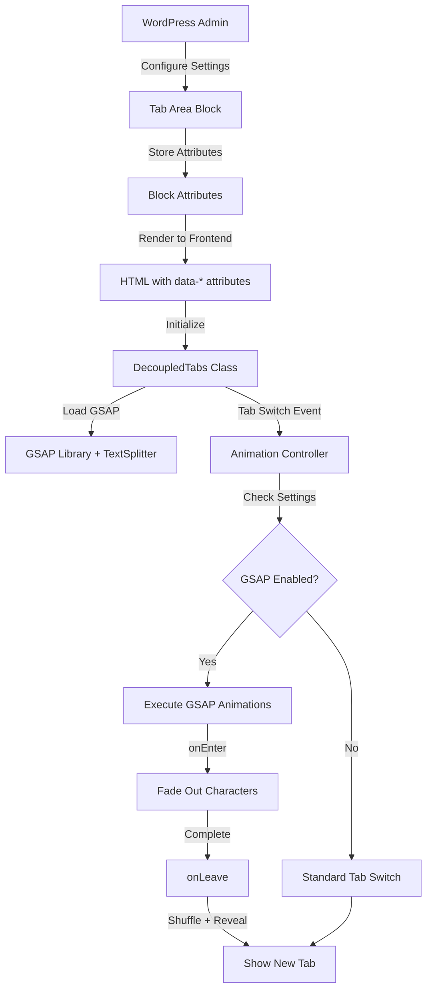

# Design Document: GSAP Tab Animation

## Overview

This feature extends the Decoupled Tabs plugin with GSAP-powered character animations during tab transitions. The implementation adds a configurable animation system that splits text into individual characters and applies staggered fade-out and shuffle effects. The design maintains backward compatibility with existing tab functionality while providing an opt-in animation layer.

The animation consists of two phases:
1. **onEnter (Exit Animation)**: Characters fade out with a stagger effect from end to start
2. **onLeave (Enter Animation)**: Characters shuffle through random letters before revealing final content

All animation parameters are configurable through WordPress block settings, giving administrators full control over timing, iterations, and stagger behavior.

## Architecture

### High-Level Architecture



### Component Interaction Flow

1. **Configuration Layer**: WordPress block editor provides UI controls for animation settings
2. **Data Layer**: Block attributes store animation configuration and pass it to frontend via data attributes
3. **Script Loading Layer**: PHP enqueues GSAP libraries from CDN with proper dependencies
4. **Animation Layer**: JavaScript animation controller intercepts tab switches and executes GSAP animations
5. **Cleanup Layer**: Animation lifecycle management prevents memory leaks and handles rapid switching

## Components and Interfaces

### 1. PHP Script Enqueue Component

**Location**: `decoupled-tabs.php`

**Responsibilities**:
- Enqueue GSAP core library from CDN
- Enqueue GSAP TextSplitter utility from CDN
- Ensure proper script dependencies and load order
- Only load scripts on pages with tab blocks

**Interface**:
```php
function decoupled_tabs_enqueue_gsap_scripts() {
    // Enqueue GSAP core
    wp_enqueue_script(
        'gsap-core',
        'https://cdn.jsdelivr.net/npm/gsap@3.12.5/dist/gsap.min.js',
        array(),
        '3.12.5',
        true
    );
    
    // Enqueue TextSplitter
    wp_enqueue_script(
        'gsap-text-splitter',
        'https://cdn.jsdelivr.net/npm/gsap@3.12.5/dist/TextPlugin.min.js',
        array('gsap-core'),
        '3.12.5',
        true
    );
    
    // Update frontend script dependencies
    wp_enqueue_script(
        'decoupled-tabs-frontend',
        // ... existing code
        array('gsap-core', 'gsap-text-splitter'),
        // ... existing code
    );
}
```

### 2. Block Attributes Component

**Location**: `src/blocks/tab-area/block.json`

**Responsibilities**:
- Define animation configuration attributes
- Provide default values for all animation parameters
- Store user-configured animation settings

**Interface**:
```json
{
  "attributes": {
    "gsapEnabled": {
      "type": "boolean",
      "default": false
    },
    "gsapShuffleIterations": {
      "type": "number",
      "default": 2
    },
    "gsapCharDuration": {
      "type": "number",
      "default": 0.02
    },
    "gsapStaggerAmount": {
      "type": "number",
      "default": 0.25
    },
    "gsapStaggerDelay": {
      "type": "number",
      "default": 0.03
    },
    "gsapOnEnterDuration": {
      "type": "number",
      "default": 0.02
    }
  }
}
```

### 3. Block Editor UI Component

**Location**: `src/blocks/tab-area/edit.js`

**Responsibilities**:
- Render toggle control for enabling GSAP animations
- Conditionally render animation parameter controls
- Update block attributes when settings change
- Provide user-friendly labels and help text

**Interface**:
```javascript
// Inspector Controls addition
<PanelBody title="GSAP Animations" initialOpen={false}>
    <ToggleControl
        label="Enable GSAP Animations"
        checked={gsapEnabled}
        onChange={(value) => setAttributes({ gsapEnabled: value })}
    />
    
    {gsapEnabled && (
        <>
            <RangeControl
                label="Shuffle Iterations"
                value={gsapShuffleIterations}
                onChange={(value) => setAttributes({ gsapShuffleIterations: value })}
                min={1}
                max={10}
            />
            {/* Additional controls for other parameters */}
        </>
    )}
</PanelBody>
```

### 4. Block Save Component

**Location**: `src/blocks/tab-area/save.js`

**Responsibilities**:
- Output animation settings as data attributes on the tab area element
- Ensure data attributes are properly formatted for JavaScript consumption

**Interface**:
```javascript
<div
    className="decoupled-tabs-area"
    data-tab-area-id={tabAreaId}
    data-gsap-enabled={gsapEnabled}
    data-gsap-shuffle-iterations={gsapShuffleIterations}
    data-gsap-char-duration={gsapCharDuration}
    data-gsap-stagger-amount={gsapStaggerAmount}
    data-gsap-stagger-delay={gsapStaggerDelay}
    data-gsap-on-enter-duration={gsapOnEnterDuration}
>
    {/* Tab content */}
</div>
```

### 5. Animation Controller Component

**Location**: `src/frontend/tabs.js` (extension to DecoupledTabs class)

**Responsibilities**:
- Detect GSAP animation settings during initialization
- Intercept tab switch events when GSAP is enabled
- Execute onEnter animation (fade out)
- Execute onLeave animation (shuffle + reveal)
- Manage animation lifecycle and cleanup
- Handle rapid tab switching gracefully

**Interface**:
```javascript
class DecoupledTabs {
    initTabArea(area) {
        // ... existing code
        
        // Read GSAP settings
        const gsapEnabled = area.dataset.gsapEnabled === 'true';
        const gsapConfig = {
            shuffleIterations: parseInt(area.dataset.gsapShuffleIterations) || 2,
            charDuration: parseFloat(area.dataset.gsapCharDuration) || 0.02,
            staggerAmount: parseFloat(area.dataset.gsapStaggerAmount) || 0.25,
            staggerDelay: parseFloat(area.dataset.gsapStaggerDelay) || 0.03,
            onEnterDuration: parseFloat(area.dataset.gsapOnEnterDuration) || 0.02
        };
        
        this.tabAreas.set(areaId, {
            // ... existing properties
            gsapEnabled,
            gsapConfig
        });
    }
    
    activateTab(tab, immediate, tabAreaData) {
        // ... existing code
        
        if (tabAreaData.gsapEnabled && !immediate && currentTab) {
            this.executeGSAPTransition(currentTab, tab, tabAreaData);
        } else {
            // Standard tab switch
        }
    }
    
    executeGSAPTransition(fromTab, toTab, tabAreaData) {
        const { gsapConfig } = tabAreaData;
        
        // Execute onEnter animation on outgoing tab
        this.gsapOnEnter(fromTab, gsapConfig, () => {
            // Execute onLeave animation on incoming tab
            this.gsapOnLeave(toTab, gsapConfig, () => {
                // Complete tab switch
                this.completeTabSwitch(fromTab, toTab, tabAreaData);
            });
        });
    }
    
    gsapOnEnter(target, config, onComplete) {
        // Kill existing animation
        if (target.currentTween) {
            target.currentTween.kill();
        }
        
        // Reset element
        this.resetElement(target);
        
        // Split text into characters
        target.textSplitter = new SplitText(target, { type: 'chars' });
        
        // Animate characters to opacity 0
        target.currentTween = gsap.to(target.textSplitter.chars, {
            duration: config.onEnterDuration,
            ease: 'none',
            autoAlpha: 0,
            stagger: {
                amount: config.staggerAmount,
                from: 'end'
            },
            onComplete: () => {
                target.currentTween = null;
                onComplete();
            }
        });
    }
    
    gsapOnLeave(target, config, onComplete) {
        // Kill existing animation
        if (target.currentTween) {
            target.currentTween.kill();
        }
        
        const chars = target.textSplitter.chars;
        
        // Create timeline for shuffle effect
        const tl = gsap.timeline({
            onComplete: () => {
                this.resetElement(target);
                target.currentTween = null;
                onComplete();
            }
        });
        
        // Animate each character with shuffle effect
        chars.forEach((char, index) => {
            const originalChar = char.innerHTML;
            
            // Shuffle iterations
            for (let i = 0; i < config.shuffleIterations; i++) {
                tl.to(char, {
                    duration: config.charDuration,
                    textContent: this.getRandomChar(),
                    autoAlpha: 1,
                    ease: 'none'
                }, index * config.staggerDelay);
            }
            
            // Restore original character
            tl.to(char, {
                duration: config.charDuration,
                textContent: originalChar,
                autoAlpha: 1,
                ease: 'none'
            }, index * config.staggerDelay);
        });
        
        target.currentTween = tl;
    }
    
    getRandomChar() {
        const letters = 'ABCDEFGHIJKLMNOPQRSTUVWXYZabcdefghijklmnopqrstuvwxyz';
        return letters.charAt(Math.floor(Math.random() * letters.length));
    }
    
    resetElement(target) {
        if (target.textSplitter) {
            target.textSplitter.revert();
            target.textSplitter = null;
        }
        gsap.set(target, { clearProps: 'all' });
    }
}
```

## Data Models

### Tab Area Configuration Model

```typescript
interface TabAreaConfig {
    // Existing properties
    element: HTMLElement;
    tabs: HTMLElement[];
    smoothHeight: boolean;
    transitionDuration: number;
    currentTab: HTMLElement | null;
    isTransitioning: boolean;
    
    // New GSAP properties
    gsapEnabled: boolean;
    gsapConfig: GSAPAnimationConfig;
}

interface GSAPAnimationConfig {
    shuffleIterations: number;      // Number of random character iterations (default: 2)
    charDuration: number;            // Duration per character animation in seconds (default: 0.02)
    staggerAmount: number;           // Total stagger duration in seconds (default: 0.25)
    staggerDelay: number;            // Delay between character animations in seconds (default: 0.03)
    onEnterDuration: number;         // Duration for fade-out animation in seconds (default: 0.02)
}
```

### Animation State Model

```typescript
interface AnimationState {
    currentTween: GSAPTween | GSAPTimeline | null;  // Current animation instance
    textSplitter: SplitText | null;                  // Text splitter instance
}

// Extended HTMLElement with animation state
interface AnimatedElement extends HTMLElement {
    currentTween?: GSAPTween | GSAPTimeline | null;
    textSplitter?: SplitText | null;
}
```


## Correctness Properties

*A property is a characteristic or behavior that should hold true across all valid executions of a system-essentially, a formal statement about what the system should do. Properties serve as the bridge between human-readable specifications and machine-verifiable correctness guarantees.*

### Property Reflection

After analyzing all acceptance criteria, several properties can be consolidated:
- Properties 4.1-4.4 (animation sequence) can be combined into a single comprehensive property about animation flow
- Properties 4.5-4.8 (shuffle behavior) can be combined into one property about shuffle mechanics
- Properties 5.1-5.4 (interruption handling) overlap significantly and can be consolidated
- Properties 6.1-6.2 (configuration detection) can be combined
- Many "example" tests (UI controls, defaults) don't need properties - they're better as unit tests

### Core Properties

**Property 1: Block attribute persistence**
*For any* Tab Area block with GSAP animations enabled and any valid animation configuration, saving the block should preserve all animation settings in the block attributes, and those attributes should be retrievable when the block is loaded again.
**Validates: Requirements 2.4**

**Property 2: Animation parameter reactivity**
*For any* animation parameter (shuffle iterations, char duration, stagger amount, stagger delay, onEnter duration), modifying its value in the block editor should immediately update the corresponding block attribute.
**Validates: Requirements 3.6**

**Property 3: Animation sequence execution**
*For any* tab switch with GSAP enabled, the system should execute onEnter animation on the outgoing tab, wait for completion, then execute onLeave animation on the incoming tab, and finally update tab visibility.
**Validates: Requirements 4.1, 4.4, 6.4**

**Property 4: Text splitting and character animation**
*For any* tab content element, when onEnter animation executes, the text should be split into individual characters, and each character should animate to opacity 0 with a stagger effect from end to start.
**Validates: Requirements 4.2, 4.3**

**Property 5: Shuffle round-trip consistency**
*For any* text content and any number of shuffle iterations, after the shuffle effect completes, the final displayed text should exactly match the original text content.
**Validates: Requirements 4.7**

**Property 6: Shuffle iteration count**
*For any* character and any configured shuffle iteration count N, the shuffle effect should replace that character with random letters exactly N times before restoring the original character.
**Validates: Requirements 4.6**

**Property 7: Character visibility restoration**
*For any* set of characters in the onLeave animation, all characters should reach opacity 1 by the time the animation completes.
**Validates: Requirements 4.8**

**Property 8: Animation cleanup**
*For any* completed animation sequence, the system should clean up all GSAP tween instances, timeline instances, and text splitter instances, leaving no references that could cause memory leaks.
**Validates: Requirements 4.9**

**Property 9: Animation interruption handling**
*For any* in-progress animation, if a new tab switch is triggered, the current animation should be killed immediately, element state should be reset, and the new animation should start without queue buildup.
**Validates: Requirements 5.1, 5.2, 5.3, 5.4**

**Property 10: Configuration-based execution**
*For any* tab area, if GSAP animations are enabled, tab switches should execute GSAP animations; if disabled, tab switches should use standard behavior without executing any GSAP code.
**Validates: Requirements 6.1, 6.2, 6.3**

**Property 11: Smooth height compatibility**
*For any* tab area with both GSAP animations and smooth height transitions enabled, executing a tab switch should successfully complete both the GSAP character animations and the smooth height transition without conflicts.
**Validates: Requirements 6.5**

## Error Handling

### Script Loading Errors

**Scenario**: GSAP library fails to load from CDN

**Handling**:
- Check for `window.gsap` availability before executing animations
- Fall back to standard tab switching if GSAP is unavailable
- Log warning to console for debugging
- Do not break tab functionality

**Implementation**:
```javascript
if (typeof gsap === 'undefined' || typeof SplitText === 'undefined') {
    console.warn('Decoupled Tabs: GSAP not available, falling back to standard transitions');
    tabAreaData.gsapEnabled = false;
}
```

### Animation Errors

**Scenario**: Text splitting fails on non-text content

**Handling**:
- Wrap text splitting in try-catch block
- Fall back to standard tab switch on error
- Log error details for debugging
- Clean up any partial animation state

**Implementation**:
```javascript
try {
    target.textSplitter = new SplitText(target, { type: 'chars' });
} catch (error) {
    console.error('Decoupled Tabs: Text splitting failed', error);
    this.resetElement(target);
    return this.standardTabSwitch(fromTab, toTab, tabAreaData);
}
```

### Invalid Configuration

**Scenario**: Animation parameters have invalid values (negative, NaN, etc.)

**Handling**:
- Validate all numeric parameters during initialization
- Clamp values to reasonable ranges
- Use defaults for invalid values
- Log warnings for invalid configurations

**Implementation**:
```javascript
const gsapConfig = {
    shuffleIterations: Math.max(1, Math.min(10, parseInt(area.dataset.gsapShuffleIterations) || 2)),
    charDuration: Math.max(0.01, Math.min(1, parseFloat(area.dataset.gsapCharDuration) || 0.02)),
    staggerAmount: Math.max(0, Math.min(2, parseFloat(area.dataset.gsapStaggerAmount) || 0.25)),
    staggerDelay: Math.max(0, Math.min(0.5, parseFloat(area.dataset.gsapStaggerDelay) || 0.03)),
    onEnterDuration: Math.max(0.01, Math.min(1, parseFloat(area.dataset.gsapOnEnterDuration) || 0.02))
};
```

### Rapid Tab Switching

**Scenario**: User clicks multiple tabs rapidly during animations

**Handling**:
- Kill current animation immediately
- Reset element state completely
- Start new animation fresh
- Prevent animation queue buildup
- Maintain UI responsiveness

**Implementation**: Already covered in animation controller design with `currentTween.kill()` and `resetElement()` calls.

### Missing Tab Content

**Scenario**: Tab content element is missing or empty

**Handling**:
- Check for valid tab content before animating
- Skip animation if content is invalid
- Proceed with standard tab switch
- Log warning for debugging

**Implementation**:
```javascript
if (!fromTab || !toTab || !fromTab.textContent.trim() || !toTab.textContent.trim()) {
    console.warn('Decoupled Tabs: Invalid tab content for GSAP animation');
    return this.standardTabSwitch(fromTab, toTab, tabAreaData);
}
```

## Testing Strategy

### Unit Testing

Unit tests will verify specific behaviors and edge cases:

1. **Script Enqueue Tests**
   - Verify GSAP core script is enqueued with correct URL and version
   - Verify TextSplitter script is enqueued with GSAP as dependency
   - Verify scripts are only enqueued on pages with tab blocks
   - Verify script load order is correct

2. **Block Editor Tests**
   - Verify toggle control renders in block inspector
   - Verify animation controls appear when toggle is enabled
   - Verify animation controls hide when toggle is disabled
   - Verify default values for all animation parameters
   - Verify parameter validation (min/max ranges)

3. **Configuration Tests**
   - Verify data attributes are correctly output in save function
   - Verify configuration is correctly parsed during initialization
   - Verify invalid values are clamped to valid ranges
   - Verify fallback to defaults when attributes are missing

4. **Error Handling Tests**
   - Verify graceful fallback when GSAP is unavailable
   - Verify error handling for text splitting failures
   - Verify handling of empty or missing tab content
   - Verify cleanup after animation errors

### Property-Based Testing

Property-based tests will verify universal behaviors across many inputs using **fast-check** (JavaScript property testing library). Each test will run a minimum of 100 iterations.

1. **Property Test: Block Attribute Persistence (Property 1)**
   - Generate random valid animation configurations
   - Save block with configuration
   - Load block and verify all attributes match
   - Validates: Requirements 2.4

2. **Property Test: Animation Parameter Reactivity (Property 2)**
   - Generate random parameter values within valid ranges
   - Update each parameter in block editor
   - Verify corresponding attribute updates immediately
   - Validates: Requirements 3.6

3. **Property Test: Animation Sequence Execution (Property 3)**
   - Generate random tab pairs
   - Trigger tab switch with GSAP enabled
   - Verify onEnter executes first, then onLeave, then visibility update
   - Validates: Requirements 4.1, 4.4, 6.4

4. **Property Test: Text Splitting and Character Animation (Property 4)**
   - Generate random text content
   - Execute onEnter animation
   - Verify text is split into characters
   - Verify all characters animate to opacity 0
   - Verify stagger effect from end to start
   - Validates: Requirements 4.2, 4.3

5. **Property Test: Shuffle Round-Trip Consistency (Property 5)**
   - Generate random text content
   - Execute complete shuffle animation
   - Verify final text exactly matches original
   - Validates: Requirements 4.7

6. **Property Test: Shuffle Iteration Count (Property 6)**
   - Generate random iteration counts (1-10)
   - Generate random characters
   - Execute shuffle effect
   - Count actual shuffle iterations
   - Verify count matches configuration
   - Validates: Requirements 4.6

7. **Property Test: Character Visibility Restoration (Property 7)**
   - Generate random text content
   - Execute onLeave animation
   - Verify all characters reach opacity 1
   - Validates: Requirements 4.8

8. **Property Test: Animation Cleanup (Property 8)**
   - Generate random tab transitions
   - Execute complete animation
   - Verify no tween references remain
   - Verify no timeline references remain
   - Verify text splitter is cleaned up
   - Validates: Requirements 4.9

9. **Property Test: Animation Interruption Handling (Property 9)**
   - Generate random tab switch sequences
   - Interrupt animations at random points
   - Verify current animation is killed
   - Verify element state is reset
   - Verify new animation starts cleanly
   - Verify no queue buildup
   - Validates: Requirements 5.1, 5.2, 5.3, 5.4

10. **Property Test: Configuration-Based Execution (Property 10)**
    - Generate random tab areas with GSAP enabled/disabled
    - Trigger tab switches
    - Verify GSAP code executes only when enabled
    - Verify standard behavior when disabled
    - Validates: Requirements 6.1, 6.2, 6.3

11. **Property Test: Smooth Height Compatibility (Property 11)**
    - Generate random tab areas with both features enabled
    - Execute tab switches
    - Verify GSAP animations complete successfully
    - Verify smooth height transitions complete successfully
    - Verify no conflicts or errors
    - Validates: Requirements 6.5

### Integration Testing

Integration tests will verify the complete feature works end-to-end:

1. **Full Animation Flow Test**
   - Create tab area with GSAP enabled
   - Configure animation parameters
   - Trigger tab switch
   - Verify complete animation sequence
   - Verify final state is correct

2. **WordPress Integration Test**
   - Create tab area block in editor
   - Configure GSAP settings
   - Save and publish page
   - Load page in frontend
   - Verify animations work correctly

3. **Multiple Tab Areas Test**
   - Create multiple tab areas with different GSAP settings
   - Verify each area uses its own configuration
   - Verify no interference between areas

### Testing Tools

- **Jest**: Unit testing framework
- **fast-check**: Property-based testing library for JavaScript
- **@wordpress/scripts**: WordPress testing utilities
- **JSDOM**: DOM simulation for Node.js testing environment
- **GSAP**: Animation library (mocked for unit tests, real for integration tests)
